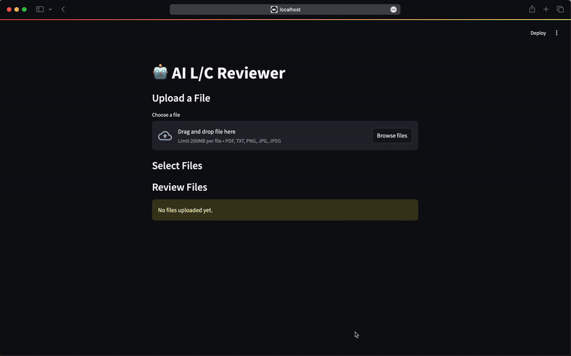

# L/C-AI: Automated Letter of Credit Verification

## Overview

L/C-AI is an AI-powered tool that automates the verification of Letter of Credit (L/C) applications by comparing them against a contract. Using OpenAI's API, it detects discrepancies between the two documents to ensure compliance and accuracy. A sample documents and review results are provided in [`/docs`](./docs) folder.



## Features

- Upload a draft L/C application and a contract.
- AI-powered discrepancy detection using OpenAI's language model.
- Generate a report highlighting differences and potential issues.

## Installation

### Prerequisites

- Tested with Python 3.13.1
- OpenAI API key
- FastAPI for API handling

### Setup

1. Clone the repository:
   ```bash
   git clone https://github.com/fkaita/LC-AI.git
   cd LC-AI
   ```
2. Install dependencies:
   ```bash
   pip install -e .
   ```
3. Set up your OpenAI API key in .env:
   ```bash
   OPENAI_API_KEY=your-api-key
   ```

## Usage

### Running the API

Start the FastAPI server:

```bash
python code/api.py
```

### API Endpoints

#### For review a L/C draft with a contract

**Endpoint:**

```http
POST /review/
```

**Request:**

```json
{
  "lc_filepath": "file path to L/C application document",
  "contract_filepath": "file path to contract document"
}
```

**Response:**

The response is provided with streaming.

```json
{[
  "progress-message: Analyzing L/C draft...\n"
  "progress-message: Checking L/C draft with contract...\n"
  "progress-message: Making summary...\n"
  "progress-message: Finished!\n"
  "final-message: FINAL REVIEW RESULT HERE"
]}
```

### Example Request Using Curl

```bash
curl -X 'POST' 'http://127.0.0.1:8000/review/' \
     -H 'Content-Type: application/json' \
     -d '{"lc_filepath": "file path to L/C application document", "contract_filepath": "file path to contract document"}'
```

## Frontend App

You can test the API with a streamlit frontend app.

Upload two documents and press "AI Review" to get the response.

```bash
streamlit run code/app.py
```

## Future Improvements

- Improve API format.
- Improve speed of process.
- Improve accuracy with real datasets.

## License

MIT License

## Reference

The concept is inspired by AI Scientist: https://github.com/SakanaAI/AI-Scientist
